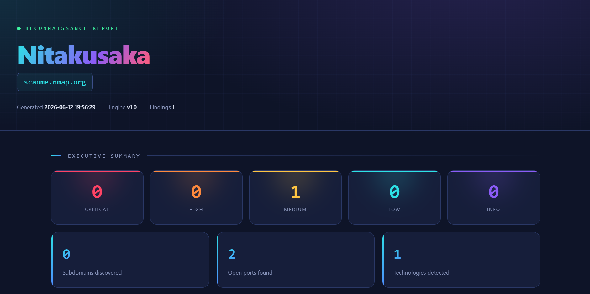

# Nitakusaka

**Automated offensive reconnaissance framework built for African infrastructure and bug bounty hunters.**


---

## Overview

Nitakusaka (Swahili: *"I will make it"*) automates the full reconnaissance phase of a penetration test or bug bounty engagement. Unlike generic recon tools built for Western infrastructure, Nitakusaka is designed with awareness of African CDNs, hosting providers, mobile money platforms, and regional TLDs (.co.tz, .co.ke, .ng).

Give it a target domain and it will enumerate subdomains, scan for open ports, probe live HTTP/S hosts, fingerprint technologies, scan for vulnerabilities, correlate findings into actionable intelligence, and generate a professional report — all from a single command.

```bash
python nitakusaka.py --target example.com --full
```

---

## What makes it different

Most recon tools hand you a list of findings and stop there. Nitakusaka goes further:

**Contextual AI wordlists** — instead of blasting the same generic wordlist every tool uses, Nitakusaka can generate target-specific subdomain guesses based on the company's industry and region using AI. Against a Tanzanian bank it generates guesses like `wakala`, `benki`, and `mpesa-gateway` that no generic wordlist contains.

**Automatic correlation** — findings from every module are cross-referenced against known vulnerability patterns automatically. An open database port combined with a sensitive subdomain gets flagged as a compound finding a single scanner would miss.

**African infrastructure awareness** — built-in knowledge of regional hosting providers, mobile money platforms (M-Pesa, Airtel Money, MTN MoMo), and African TLDs that generic tools overlook. Works on any target worldwide, but smarter on African ones.

**Industry-standard tool integration** — wraps Nmap, httpx, Nuclei, and OWASP Amass under one unified interface and reporting pipeline.

**Three audiences, one scan** — raw JSON for pipelines, polished HTML for portfolio and clients, markdown for bug bounty submissions.

---

## Architecture

```
                    nitakusaka.py (CLI)
                          │
        ┌─────────────────┼─────────────────┐
        ▼                 ▼                 ▼
   DNS Module        Port Module       HTTP Module
   + zone xfer       + Nmap            + httpx
   + AI wordlist     + banner grab     + tech fingerprint
        │                 │                 │
        └─────────────────┼─────────────────┘
                          ▼
                   Vuln Module
                   + Nuclei (9000+ templates)
                   + OWASP Amass
                          │
                          ▼
                   Correlator
                   (cross-references all findings)
                          │
                          ▼
                   Report Module
                   HTML / Markdown / JSON
```

---

## Modules

| Module | Description | Integrations |
|--------|-------------|--------------|
| `dns_module.py` | Subdomain enumeration + zone transfer attempts | dnspython |
| `ai_wordlist.py` | AI-generated contextual subdomain wordlists | Anthropic API |
| `port_module.py` | TCP port scanner with banner grabbing | Nmap |
| `http_module.py` | HTTP prober and technology fingerprinting | httpx |
| `vuln_module.py` | Vulnerability scanning + deep enumeration | Nuclei, Amass |
| `correlator.py` | Automatic vulnerability correlation engine | — |
| `report_module.py` | HTML, Markdown, and JSON report generation | Jinja2 |

---

## Installation

```bash
git clone https://github.com/Friendly-Neighbour24/Nitakusaka.git
cd Nitakusaka
pip install -r requirements.txt
```

### Optional external tools

Nitakusaka works out of the box with its built-in Python engines. For full power, install these industry-standard tools — Nitakusaka detects and uses them automatically when present:

- [Nmap](https://nmap.org/download.html) — advanced port scanning
- [httpx](https://github.com/projectdiscovery/httpx) — fast HTTP probing
- [Nuclei](https://github.com/projectdiscovery/nuclei) — vulnerability scanning
- [OWASP Amass](https://github.com/owasp-amass/amass) — deep subdomain enumeration

### AI wordlist setup (optional)

Set your Anthropic API key as an environment variable:

```bash
# Create a .env file (never commit this)
echo ANTHROPIC_API_KEY=your_key_here > .env
```

---

## Usage

```bash
# Full recon pipeline
python nitakusaka.py --target example.com --full

# Single module
python nitakusaka.py --target example.com --module dns

# DNS with AI contextual wordlist
python nitakusaka.py --target example.com --module dns --ai-wordlist

# Port scan using Nmap engine
python nitakusaka.py --target example.com --module ports --use-nmap

# Vulnerability scan with OWASP Top 10 templates
python nitakusaka.py --target example.com --module vuln --templates owasp

# Full scan, HTML report only
python nitakusaka.py --target example.com --full --report-format html
```

Run `python nitakusaka.py --help` for the complete list of options.

---

## Sample Report

Nitakusaka generates a professional HTML report with an executive summary, color-coded findings by severity, discovered subdomains, open ports with risk assessment, and detected technologies.


---

## Roadmap

- [x] DNS enumeration module
- [x] AI-assisted contextual wordlist generator
- [x] Port scanner with Nmap integration
- [x] HTTP prober with httpx integration
- [x] Vulnerability scanning with Nuclei + Amass
- [x] Correlation engine
- [x] Multi-format report generator
- [x] Unified CLI
- [ ] Reverse DNS / ASN enumeration *(v1.1)*
- [ ] Continuous monitoring mode *(v1.2)*
- [ ] African infrastructure signature database expansion

---

## Legal Disclaimer

This tool is intended for **authorized security testing only**. Always obtain explicit written permission before conducting reconnaissance against any target you do not own. Unauthorized scanning may be illegal in your jurisdiction. The author assumes no responsibility for misuse or for any damage caused by this tool. Use it ethically and responsibly.

When testing, use authorized targets such as [scanme.nmap.org](http://scanme.nmap.org) or systems within an active bug bounty program scope.

---

## Contributing

Contributions, issues, and feature requests are welcome. Feel free to check the issues page.

---

## Author

**Hans** — [@Friendly-Neighbour24](https://github.com/Friendly-Neighbour24)

Built as a portfolio project to demonstrate offensive security tooling, Python engineering, and automation design.

---

## License

This project is licensed under the MIT License — see the [LICENSE](LICENSE) file for details.
